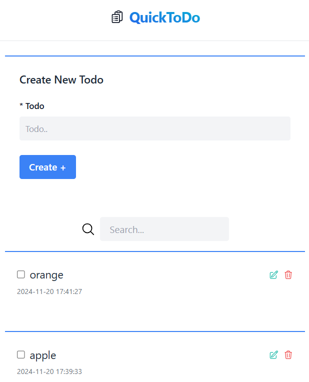

# Cloud App

The Quick Todo app is a simple and user-friendly tool designed to help you keep track of your daily tasks. It allows you to create and manage a list of items, ensuring you never forget important activities in your routine.

Clone the project into your directory and follow the given steps to run the quick todo app.

### Prerequisites
- PHP ^8.2
- Composer

## Technologies Used

- **Backend**: Laravel, Livewire
- **Frontend**: Tailwind CSS, Blade (template engine), Alpine.js
- **Database**: MySQL
- **Version Control**: Git

## Screenshots

# Navigate into the project directory:
cd your-repo

# Install Composer:
composer install

# Create a .env file:
copy .env.example to .env

# Generate an application key:
php artisan key:generate

# Create Database with name quick_todo:

# Run migrations:
php artisan migrate

# On New Terminal Start the local development server:
php artisan serve
